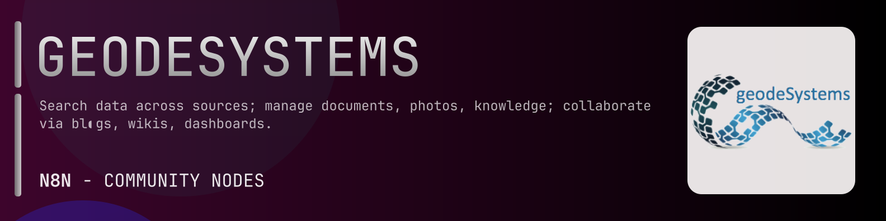

# @n8n-dev/n8n-nodes-geodesystems



[](https://www.npmjs.com/package/@n8n-dev/n8n-nodes-geodesystems)
[](https://opensource.org/licenses/MIT)

---

**Stop writing geodesystems API integrations by hand.**

Every time you connect n8n to geodesystems, you waste hours mapping endpoints, defining parameters, and debugging schemas. You copy-paste from docs, fix edge cases, and pray nothing breaks.

**What if connecting n8n to geodesystems took 5 minutes, not half a day?**

This node gives you **244+ resources** out of the box: **Gridaspoint**, **Gridsubset**, **Point**, **Service Media Tabular Extractsheet**, **Type 2017 Boulder Election Expenditures**, and 239 more: with full CRUD operations, typed parameters, and zero manual configuration.

---

## What You Get

- **Zero boilerplate**: Resources, operations, and fields are pre-configured and ready to use
- **Full CRUD**: Create, read, update, and delete support where the API allows it
- **Typed parameters**: No more guessing field types
- **Built-in auth**: API key authentication, ready to go
- **Declarative**: Native n8n performance, no custom execute() overhead

---

## Install

```bash
npm install @n8n-dev/n8n-nodes-geodesystems
```

**Or in n8n:**
1. **Settings → Community Nodes → Install**
2. Search: `@n8n-dev/n8n-nodes-geodesystems`
3. Click **Install**

---

## Quick Start

1. Install the node (above)
2. Add credentials: **geodesystems API** → paste your API key
3. Drag the **geodesystems** node into your workflow
4. Pick a resource → pick an operation → done.

That's it. No configuration files. No code. It just works.

---

## Resources

<details>
<summary><b>Service Media Tabular Extractsheet</b> (1 operations)</summary>

- Get API for Extract sheets

</details>

<details>
<summary><b>Type 2017 Boulder Election Expenditures</b> (1 operations)</summary>

- Get Search API for 2017 Boulder Election Expenditures entry type

</details>

<details>
<summary><b>Type Any</b> (1 operations)</summary>

- Get Search API for Any file type entry type

</details>

<details>
<summary><b>Type Beforeafter</b> (1 operations)</summary>

- Get Search API for Before and After Images entry type

</details>

<details>
<summary><b>Type Biblio</b> (1 operations)</summary>

- Get Search API for Bibliographic Entry entry type

</details>

<details>
<summary><b>Type Bio Dicom</b> (1 operations)</summary>

- Get Search API for DICOM File entry type

</details>

<details>
<summary><b>Type Bio Dicom Test</b> (1 operations)</summary>

- Get Search API for DICOM Test File entry type

</details>

<details>
<summary><b>Type Bio Fasta</b> (1 operations)</summary>

- Get Search API for FASTA File entry type

</details>

<details>
<summary><b>Type Bio Fastq</b> (1 operations)</summary>

- Get Search API for FASTQ File entry type

</details>

<details>
<summary><b>Type Bio Hmmer Index</b> (1 operations)</summary>

- Get Search API for HMMER Index File entry type

</details>

<details>
<summary><b>Type Bio Ome Tiff</b> (1 operations)</summary>

- Get Search API for OME TIFF File entry type

</details>

<details>
<summary><b>Type Bio Ontology Assay</b> (1 operations)</summary>

- Get Search API for Assay entry type

</details>

<details>
<summary><b>Type Bio Ontology Cohort</b> (1 operations)</summary>

- Get Search API for Cohort entry type

</details>

<details>
<summary><b>Type Bio Ontology Person</b> (1 operations)</summary>

- Get Search API for Person entry type

</details>

<details>
<summary><b>Type Bio Ontology Sample</b> (1 operations)</summary>

- Get Search API for Sample entry type

</details>

<details>
<summary><b>Type Bio Ontology Series</b> (1 operations)</summary>

- Get Search API for Series entry type

</details>

<details>
<summary><b>Type Bio Ontology Study</b> (1 operations)</summary>

- Get Search API for Study entry type

</details>

<details>
<summary><b>Type Bio Sam</b> (1 operations)</summary>

- Get Search API for SAM Data entry type

</details>

<details>
<summary><b>Type Bio Sf Pdb</b> (1 operations)</summary>

- Get Search API for PDB Protein File entry type

</details>

<details>
<summary><b>Type Bio Sra</b> (1 operations)</summary>

- Get Search API for Sequence Read Archive entry type

</details>

<details>
<summary><b>Type Bio Stockholm</b> (1 operations)</summary>

- Get Search API for Stockholm File entry type

</details>

<details>
<summary><b>Type Bio Taxonomy</b> (1 operations)</summary>

- Get Search API for Taxonomic Entry entry type

</details>

<details>
<summary><b>Type Blogentry</b> (1 operations)</summary>

- Get Search API for Weblog Entry entry type

</details>

<details>
<summary><b>Type Bolder Rental Housing</b> (1 operations)</summary>

- Get Search API for Boulder Rental Housing entry type

</details>

<details>
<summary><b>Type Bookmarks</b> (1 operations)</summary>

- Get Search API for Bookmarks entry type

</details>

<details>
<summary><b>Type Boston Crime</b> (1 operations)</summary>

- Get Search API for Boston Crime entry type

</details>

<details>
<summary><b>Type Boulder 2017 Election Contributions</b> (1 operations)</summary>

- Get Search API for Boulder 2017 Election Contributions entry type

</details>

<details>
<summary><b>Type Boulder Campaign Contributions</b> (1 operations)</summary>

- Get Search API for Boulder Campaign Contributions entry type

</details>

<details>
<summary><b>Type Boulder Consulting Services</b> (1 operations)</summary>

- Get Search API for Boulder Consulting Services Database entry type

</details>

<details>
<summary><b>Type Boulder County Voter Details</b> (1 operations)</summary>

- Get Search API for Boulder County Voter Details entry type

</details>

<details>
<summary><b>Type Boulder Crimes</b> (1 operations)</summary>

- Get Search API for Boulder Crime Reports entry type

</details>

<details>
<summary><b>Type Boulder Emails</b> (1 operations)</summary>

- Get Search API for Boulder Council Emails entry type

</details>

<details>
<summary><b>Type Boulder Employee Salaries</b> (1 operations)</summary>

- Get Search API for Boulder Employee Salaries entry type

</details>

<details>
<summary><b>Type Calendar</b> (1 operations)</summary>

- Get Search API for Calendar entry type

</details>

<details>
<summary><b>Type Campaign Donors</b> (1 operations)</summary>

- Get Search API for Campaign Donors entry type

</details>

<details>
<summary><b>Type Campaign Expenditures</b> (1 operations)</summary>

- Get Search API for Campaign Expenditures entry type

</details>

<details>
<summary><b>Type Cataloglink</b> (1 operations)</summary>

- Get Search API for Catalog Link entry type

</details>

<details>
<summary><b>Type Cdm Grid</b> (1 operations)</summary>

- Get Search API for Gridded Data File entry type

</details>

<details>
<summary><b>Type Chatroom</b> (1 operations)</summary>

- Get Search API for Chat Room entry type

</details>

<details>
<summary><b>Type Colorado Water Rights</b> (1 operations)</summary>

- Get Search API for Colorado Water Rights entry type

</details>

<details>
<summary><b>Type Committee Donations</b> (1 operations)</summary>

- Get Search API for Committee Donations entry type

</details>

<details>
<summary><b>Type Community Datahub</b> (1 operations)</summary>

- Get Search API for Data Hub entry type

</details>

<details>
<summary><b>Type Community Resource</b> (1 operations)</summary>

- Get Search API for Facility entry type

</details>

<details>
<summary><b>Type Construction Permits</b> (1 operations)</summary>

- Get Search API for Construction Permits entry type

</details>

<details>
<summary><b>Type Contact</b> (1 operations)</summary>

- Get Search API for Contact List entry type

</details>

<details>
<summary><b>Type DB Co Indicators</b> (1 operations)</summary>

- Get Search API for Colorado Health Indicators entry type

</details>

<details>
<summary><b>Type Earth Satellite Landsat</b> (1 operations)</summary>

- Get Search API for Landsat Satellite Data entry type

</details>

<details>
<summary><b>Type Faq</b> (1 operations)</summary>

- Get Search API for FAQ entry type

</details>

<details>
<summary><b>Type Fec Pacs</b> (1 operations)</summary>

- Get Search API for FEC PACs entry type

</details>

<details>
<summary><b>Type Feccandidates</b> (1 operations)</summary>

- Get Search API for Candidates entry type

</details>

<details>
<summary><b>Type Feed</b> (1 operations)</summary>

- Get Search API for RSS ATOM Feed entry type

</details>

<details>
<summary><b>Type File</b> (1 operations)</summary>

- Get Search API for File entry type

</details>

<details>
<summary><b>Type Fits Data</b> (1 operations)</summary>

- Get Search API for FITS Data File entry type

</details>

<details>
<summary><b>Type FTP</b> (1 operations)</summary>

- Get Search API for Remote FTP File View entry type

</details>

<details>
<summary><b>Type Gadgets Countdown</b> (1 operations)</summary>

- Get Search API for Countdown entry type

</details>

<details>
<summary><b>Type Gadgets Stock</b> (1 operations)</summary>

- Get Search API for Stock Ticker entry type

</details>

<details>
<summary><b>Type Gadgets Weather</b> (1 operations)</summary>

- Get Search API for Weather entry type

</details>

<details>
<summary><b>Type Gazeteer Census Tracts</b> (1 operations)</summary>

- Get Search API for Census Tracts entry type

</details>

<details>
<summary><b>Type Gazeteer Counties</b> (1 operations)</summary>

- Get Search API for Census Gazeteer Counties entry type

</details>

<details>
<summary><b>Type Geo Ge</b> (1 operations)</summary>

- Get Search API for GeoJson File entry type

</details>

<details>
<summary><b>Type Geo Geotiff</b> (1 operations)</summary>

- Get Search API for GeoTIFF entry type

</details>

<details>
<summary><b>Type Geo Gpx</b> (1 operations)</summary>

- Get Search API for GPX GPS File entry type

</details>

<details>
<summary><b>Type Geo Hdf 5</b> (1 operations)</summary>

- Get Search API for HDF5 File entry type

</details>

<details>
<summary><b>Type Geo Kml</b> (1 operations)</summary>

- Get Search API for KML KMZ File entry type

</details>

<details>
<summary><b>Type Geo Shapefile</b> (1 operations)</summary>

- Get Search API for Shapefile entry type

</details>

<details>
<summary><b>Type Geo Shapefile Fips</b> (1 operations)</summary>

- Get Search API for Shapefile with FIPS Code entry type

</details>

<details>
<summary><b>Type Glossary</b> (1 operations)</summary>

- Get Search API for Glossary entry type

</details>

<details>
<summary><b>Type Gridaggregation</b> (1 operations)</summary>

- Get Search API for Grid Aggregation entry type

</details>

<details>
<summary><b>Type Group</b> (1 operations)</summary>

- Get Search API for Folder entry type

</details>

<details>
<summary><b>Type Hipchat Group</b> (1 operations)</summary>

- Get Search API for HipChat Group entry type

</details>

<details>
<summary><b>Type Homepage</b> (1 operations)</summary>

- Get Search API for Home Page entry type

</details>

<details>
<summary><b>Type Incident</b> (1 operations)</summary>

- Get Search API for Incident entry type

</details>

<details>
<summary><b>Type Jeopardy</b> (1 operations)</summary>

- Get Search API for Jeopardy entry type

</details>

<details>
<summary><b>Type Latlonimage</b> (1 operations)</summary>

- Get Search API for Lat Lon Image entry type

</details>

<details>
<summary><b>Type Lidar Collection</b> (1 operations)</summary>

- Get Search API for LiDAR Collection entry type

</details>

<details>
<summary><b>Type Lidar Las</b> (1 operations)</summary>

- Get Search API for LAS Lidar Data entry type

</details>

<details>
<summary><b>Type Lidar Lvis</b> (1 operations)</summary>

- Get Search API for LVIS Lidar Data entry type

</details>

<details>
<summary><b>Type Link</b> (1 operations)</summary>

- Get Search API for Link entry type

</details>

<details>
<summary><b>Type Localfiles</b> (1 operations)</summary>

- Get Search API for Server Side Files entry type

</details>

<details>
<summary><b>Type Locations</b> (1 operations)</summary>

- Get Search API for Locations entry type

</details>

<details>
<summary><b>Type Map Googlemap</b> (1 operations)</summary>

- Get Search API for Google Map URL entry type

</details>

<details>
<summary><b>Type Media Audiofile</b> (1 operations)</summary>

- Get Search API for Audio File entry type

</details>

<details>
<summary><b>Type Media Imageloop</b> (1 operations)</summary>

- Get Search API for Image Loop entry type

</details>

<details>
<summary><b>Type Media Photoalbum</b> (1 operations)</summary>

- Get Search API for Photo Album entry type

</details>

<details>
<summary><b>Type Media Video Channel</b> (1 operations)</summary>

- Get Search API for Video Channel entry type

</details>

<details>
<summary><b>Type Media Video Quicktime</b> (1 operations)</summary>

- Get Search API for Quicktime Video entry type

</details>

<details>
<summary><b>Type Media Youtubevideo</b> (1 operations)</summary>

- Get Search API for YouTube Video entry type

</details>

<details>
<summary><b>Type Notes</b> (1 operations)</summary>

- Get Search API for Notes entry type

</details>

<details>
<summary><b>Type Notes Jsonfile</b> (1 operations)</summary>

- Get Search API for JSON File entry type

</details>

<details>
<summary><b>Type Notes Note</b> (1 operations)</summary>

- Get Search API for Note entry type

</details>

<details>
<summary><b>Type Notes Notebook</b> (1 operations)</summary>

- Get Search API for Notebook entry type

</details>

<details>
<summary><b>Type Nwsfeed</b> (1 operations)</summary>

- Get Search API for NWS Forecast Feed entry type

</details>

<details>
<summary><b>Type Opendaplink</b> (1 operations)</summary>

- Get Search API for OPeNDAP Link entry type

</details>

<details>
<summary><b>Type Owl Class</b> (1 operations)</summary>

- Get Search API for OWL Class entry type

</details>

<details>
<summary><b>Type Owl Ontology</b> (1 operations)</summary>

- Get Search API for OWL Ontology entry type

</details>

<details>
<summary><b>Type Pasteitentry</b> (1 operations)</summary>

- Get Search API for Paste Text Entry entry type

</details>

<details>
<summary><b>Type Point Text</b> (1 operations)</summary>

- Get Search API for Text Point Data entry type

</details>

<details>
<summary><b>Type Police Stop Data</b> (1 operations)</summary>

- Get Search API for Police Stop Data entry type

</details>

<details>
<summary><b>Type Poll</b> (1 operations)</summary>

- Get Search API for Poll entry type

</details>

<details>
<summary><b>Type Project Campaign</b> (1 operations)</summary>

- Get Search API for Campaign entry type

</details>

<details>
<summary><b>Type Project Casestudy</b> (1 operations)</summary>

- Get Search API for Case Study entry type

</details>

<details>
<summary><b>Type Project Contribution</b> (1 operations)</summary>

- Get Search API for Research Contribution entry type

</details>

<details>
<summary><b>Type Project Dataformat</b> (1 operations)</summary>

- Get Search API for Data Format entry type

</details>

<details>
<summary><b>Type Project Dataset</b> (1 operations)</summary>

- Get Search API for Dataset entry type

</details>

<details>
<summary><b>Type Project Deployment</b> (1 operations)</summary>

- Get Search API for Deployment entry type

</details>

<details>
<summary><b>Type Project Experiment</b> (1 operations)</summary>

- Get Search API for Experiment entry type

</details>

<details>
<summary><b>Type Project Fieldnote</b> (1 operations)</summary>

- Get Search API for Field Note entry type

</details>

<details>
<summary><b>Type Project Gps Controlpoints</b> (1 operations)</summary>

- Get Search API for Control Points File entry type

</details>

<details>
<summary><b>Type Project Gps Raw</b> (1 operations)</summary>

- Get Search API for Raw GPS File entry type

</details>

<details>
<summary><b>Type Project Gps Rinex</b> (1 operations)</summary>

- Get Search API for RINEX File entry type

</details>

<details>
<summary><b>Type Project Instrument</b> (1 operations)</summary>

- Get Search API for Instrument Data Collection entry type

</details>

<details>
<summary><b>Type Project Learning Resource</b> (1 operations)</summary>

- Get Search API for Teaching Resource entry type

</details>

<details>
<summary><b>Type Project Meeting</b> (1 operations)</summary>

- Get Search API for Meeting entry type

</details>

<details>
<summary><b>Type Project Organization</b> (1 operations)</summary>

- Get Search API for Organization entry type

</details>

<details>
<summary><b>Type Project Program</b> (1 operations)</summary>

- Get Search API for Program entry type

</details>

<details>
<summary><b>Type Project Project</b> (1 operations)</summary>

- Get Search API for Project entry type

</details>

<details>
<summary><b>Type Project Service</b> (1 operations)</summary>

- Get Search API for Data Access Service entry type

</details>

<details>
<summary><b>Type Project Site</b> (1 operations)</summary>

- Get Search API for Site entry type

</details>

<details>
<summary><b>Type Project Softwarepackage</b> (1 operations)</summary>

- Get Search API for Software Tool entry type

</details>

<details>
<summary><b>Type Project Standard Name</b> (1 operations)</summary>

- Get Search API for Standard Parameter Name entry type

</details>

<details>
<summary><b>Type Project Surveylocation</b> (1 operations)</summary>

- Get Search API for Survey Location entry type

</details>

<details>
<summary><b>Type Project Term</b> (1 operations)</summary>

- Get Search API for Vocabulary Term entry type

</details>

<details>
<summary><b>Type Project Visit</b> (1 operations)</summary>

- Get Search API for Site Visit entry type

</details>

<details>
<summary><b>Type Project Vocabulary</b> (1 operations)</summary>

- Get Search API for Vocabulary entry type

</details>

<details>
<summary><b>Type Property Sales</b> (1 operations)</summary>

- Get Search API for Property Sales entry type

</details>

<details>
<summary><b>Type Propertydb</b> (1 operations)</summary>

- Get Search API for Property Database entry type

</details>

<details>
<summary><b>Type Python Notebook</b> (1 operations)</summary>

- Get Search API for IPython Notebook file entry type

</details>

<details>
<summary><b>Type Slack Team</b> (1 operations)</summary>

- Get Search API for Slack Team entry type

</details>

<details>
<summary><b>Type Statusboard</b> (1 operations)</summary>

- Get Search API for Status Board entry type

</details>

<details>
<summary><b>Type Sunrisesunset</b> (1 operations)</summary>

- Get Search API for Sunrise Sunset Display entry type

</details>

<details>
<summary><b>Type Tasks</b> (1 operations)</summary>

- Get Search API for Tasks entry type

</details>

<details>
<summary><b>Type Tmdbmovies</b> (1 operations)</summary>

- Get Search API for Tmdb Movies entry type

</details>

<details>
<summary><b>Type Todo</b> (1 operations)</summary>

- Get Search API for Todo entry type

</details>

<details>
<summary><b>Type Trip Event</b> (1 operations)</summary>

- Get Search API for Event entry type

</details>

<details>
<summary><b>Type Trip Flight</b> (1 operations)</summary>

- Get Search API for Flight Leg entry type

</details>

<details>
<summary><b>Type Trip Hotel</b> (1 operations)</summary>

- Get Search API for Lodging entry type

</details>

<details>
<summary><b>Type Trip Report</b> (1 operations)</summary>

- Get Search API for Trip Report entry type

</details>

<details>
<summary><b>Type Trip Trip</b> (1 operations)</summary>

- Get Search API for Trip entry type

</details>

<details>
<summary><b>Type Type Awc Metar</b> (1 operations)</summary>

- Get Search API for AWC Weather Observations entry type

</details>

<details>
<summary><b>Type Type Biz Stockseries</b> (1 operations)</summary>

- Get Search API for Stock Ticker Data entry type

</details>

<details>
<summary><b>Type Type Bls Series</b> (1 operations)</summary>

- Get Search API for BLS Series entry type

</details>

<details>
<summary><b>Type Type Bls Survey</b> (1 operations)</summary>

- Get Search API for BLS Survey entry type

</details>

<details>
<summary><b>Type Type Census Acs</b> (1 operations)</summary>

- Get Search API for US Census ACS Data entry type

</details>

<details>
<summary><b>Type Type Daymet</b> (1 operations)</summary>

- Get Search API for Daymet Daily Weather entry type

</details>

<details>
<summary><b>Type Type DB Table</b> (1 operations)</summary>

- Get Search API for Database Table entry type

</details>

<details>
<summary><b>Type Type Document CSV</b> (1 operations)</summary>

- Get Search API for CSV File entry type

</details>

<details>
<summary><b>Type Type Document Doc</b> (1 operations)</summary>

- Get Search API for Word File entry type

</details>

<details>
<summary><b>Type Type Document HTML</b> (1 operations)</summary>

- Get Search API for HTML File entry type

</details>

<details>
<summary><b>Type Type Document PDF</b> (1 operations)</summary>

- Get Search API for PDF File entry type

</details>

<details>
<summary><b>Type Type Document Ppt</b> (1 operations)</summary>

- Get Search API for Powerpoint File entry type

</details>

<details>
<summary><b>Type Type Document Xls</b> (1 operations)</summary>

- Get Search API for Excel File entry type

</details>

<details>
<summary><b>Type Type Drilsdown Casestudy</b> (1 operations)</summary>

- Get Search API for Drilsdown Case Study entry type

</details>

<details>
<summary><b>Type Type Edgar Filing</b> (1 operations)</summary>

- Get Search API for SEC EDGAR Filing entry type

</details>

<details>
<summary><b>Type Type Eia Category</b> (1 operations)</summary>

- Get Search API for EIA Category entry type

</details>

<details>
<summary><b>Type Type Eia Series</b> (1 operations)</summary>

- Get Search API for EIA Series entry type

</details>

<details>
<summary><b>Type Type Esri Featureserver</b> (1 operations)</summary>

- Get Search API for ESRI Feature Server entry type

</details>

<details>
<summary><b>Type Type Esri Geometryserver</b> (1 operations)</summary>

- Get Search API for ESRI Geometry Server entry type

</details>

<details>
<summary><b>Type Type Esri Gpserver</b> (1 operations)</summary>

- Get Search API for ESRI GP Server entry type

</details>

<details>
<summary><b>Type Type Esri Imageserver</b> (1 operations)</summary>

- Get Search API for ESRI Image Server entry type

</details>

<details>
<summary><b>Type Type Esri Layer</b> (1 operations)</summary>

- Get Search API for ESRI Layer entry type

</details>

<details>
<summary><b>Type Type Esri Mapserver</b> (1 operations)</summary>

- Get Search API for ESRI Map Server entry type

</details>

<details>
<summary><b>Type Type Esri Restfolder</b> (1 operations)</summary>

- Get Search API for ESRI Services Folder entry type

</details>

<details>
<summary><b>Type Type Esri Restserver</b> (1 operations)</summary>

- Get Search API for ESRI Web Server entry type

</details>

<details>
<summary><b>Type Type Esri Restservice</b> (1 operations)</summary>

- Get Search API for ESRI REST Service entry type

</details>

<details>
<summary><b>Type Type Extremes</b> (1 operations)</summary>

- Get Search API for NOAA Extremes Data entry type

</details>

<details>
<summary><b>Type Type Fred Category</b> (1 operations)</summary>

- Get Search API for FRED Category entry type

</details>

<details>
<summary><b>Type Type Fred Series</b> (1 operations)</summary>

- Get Search API for FRED Series entry type

</details>

<details>
<summary><b>Type Type Gtfs Agency</b> (1 operations)</summary>

- Get Search API for Transit Agency entry type

</details>

<details>
<summary><b>Type Type Gtfs Route</b> (1 operations)</summary>

- Get Search API for Transit Route entry type

</details>

<details>
<summary><b>Type Type Gtfs Routes</b> (1 operations)</summary>

- Get Search API for Transit Route Collection entry type

</details>

<details>
<summary><b>Type Type Gtfs Stop</b> (1 operations)</summary>

- Get Search API for Transit Stop entry type

</details>

<details>
<summary><b>Type Type Gtfs Stops</b> (1 operations)</summary>

- Get Search API for Transit Stop Collection entry type

</details>

<details>
<summary><b>Type Type Gtfs Trip</b> (1 operations)</summary>

- Get Search API for Transit Trip entry type

</details>

<details>
<summary><b>Type Type Hazarddata</b> (1 operations)</summary>

- Get Search API for Hazard Data entry type

</details>

<details>
<summary><b>Type Type Hydro Colorado</b> (1 operations)</summary>

- Get Search API for Colorado DNR Stream Gage entry type

</details>

<details>
<summary><b>Type Type Idv Bundle</b> (1 operations)</summary>

- Get Search API for IDV Bundle entry type

</details>

<details>
<summary><b>Type Type Image</b> (1 operations)</summary>

- Get Search API for Image entry type

</details>

<details>
<summary><b>Type Type Image Airport</b> (1 operations)</summary>

- Get Search API for Airport Image entry type

</details>

<details>
<summary><b>Type Type Image Webcam</b> (1 operations)</summary>

- Get Search API for Webcam entry type

</details>

<details>
<summary><b>Type Type Mb</b> (1 operations)</summary>

- Get Search API for MB Bathymetry entry type

</details>

<details>
<summary><b>Type Type Mb Collection</b> (1 operations)</summary>

- Get Search API for Bathymetry Collection entry type

</details>

<details>
<summary><b>Type Type Mb Point Basic</b> (1 operations)</summary>

- Get Search API for Basic MB point file entry type

</details>

<details>
<summary><b>Type Type Metameta Dictionary</b> (1 operations)</summary>

- Get Search API for Metadata Dictionary entry type

</details>

<details>
<summary><b>Type Type Metameta Field</b> (1 operations)</summary>

- Get Search API for Metadata Field entry type

</details>

<details>
<summary><b>Type Type Nasaames</b> (1 operations)</summary>

- Get Search API for NASA AMES File entry type

</details>

<details>
<summary><b>Type Type Ncss</b> (1 operations)</summary>

- Get Search API for NetCDF Point Subset entry type

</details>

<details>
<summary><b>Type Type Nitf</b> (1 operations)</summary>

- Get Search API for NITF File entry type

</details>

<details>
<summary><b>Type Type Point Ameriflux Level 2</b> (1 operations)</summary>

- Get Search API for Ameriflux Level 2 CSV File entry type

</details>

<details>
<summary><b>Type Type Point Amrc Final</b> (1 operations)</summary>

- Get Search API for AMRC Final QC Data entry type

</details>

<details>
<summary><b>Type Type Point Amrc Freewave</b> (1 operations)</summary>

- Get Search API for AMRC Freewave Data entry type

</details>

<details>
<summary><b>Type Type Point Czo</b> (1 operations)</summary>

- Get Search API for CZO Display File Format entry type

</details>

<details>
<summary><b>Type Type Point Gcnet</b> (1 operations)</summary>

- Get Search API for GC Net Point Data entry type

</details>

<details>
<summary><b>Type Type Point Geomag Iaga 2002</b> (1 operations)</summary>

- Get Search API for IAGA 2002 Geomagnetism Data entry type

</details>

<details>
<summary><b>Type Type Point Hydro Waterml</b> (1 operations)</summary>

- Get Search API for WaterML entry type

</details>

<details>
<summary><b>Type Type Point Icebridge Atm Icessn</b> (1 operations)</summary>

- Get Search API for ATM Ice SSN Data entry type

</details>

<details>
<summary><b>Type Type Point Icebridge Atm Qfit</b> (1 operations)</summary>

- Get Search API for ATM QFIT Data entry type

</details>

<details>
<summary><b>Type Type Point Icebridge Mccords Irmcr 2</b> (1 operations)</summary>

- Get Search API for McCords Irmcr2 Data entry type

</details>

<details>
<summary><b>Type Type Point Icebridge Mccords Irmcr 3</b> (1 operations)</summary>

- Get Search API for McCords Irmcr3 Data entry type

</details>

<details>
<summary><b>Type Type Point Icebridge Paris</b> (1 operations)</summary>

- Get Search API for Paris Data entry type

</details>

<details>
<summary><b>Type Type Point Idv</b> (1 operations)</summary>

- Get Search API for IDV Point File entry type

</details>

<details>
<summary><b>Type Type Point Inline</b> (1 operations)</summary>

- Get Search API for Inline Point File entry type

</details>

<details>
<summary><b>Type Type Point Ncdc Climate</b> (1 operations)</summary>

- Get Search API for NC DC Climate Data entry type

</details>

<details>
<summary><b>Type Type Point Netcdf</b> (1 operations)</summary>

- Get Search API for NetCDF Point File entry type

</details>

<details>
<summary><b>Type Type Point Noaa Carbon</b> (1 operations)</summary>

- Get Search API for NOAA Carbon Measurements entry type

</details>

<details>
<summary><b>Type Type Point Noaa Flask Event</b> (1 operations)</summary>

- Get Search API for NOAA Flask Event Measurements entry type

</details>

<details>
<summary><b>Type Type Point Noaa Flask Month</b> (1 operations)</summary>

- Get Search API for NOAA Flask Month Measurements entry type

</details>

<details>
<summary><b>Type Type Point Noaa Madis</b> (1 operations)</summary>

- Get Search API for NOAA MADIS Point Data entry type

</details>

<details>
<summary><b>Type Type Point Noaa Tower</b> (1 operations)</summary>

- Get Search API for NOAA Tower Network entry type

</details>

<details>
<summary><b>Type Type Point Ocean Cnv</b> (1 operations)</summary>

- Get Search API for SeaBird CNV Data entry type

</details>

<details>
<summary><b>Type Type Point Ocean CSV Sado TTS</b> (1 operations)</summary>

- Get Search API for SADO TTS Data entry type

</details>

<details>
<summary><b>Type Type Point Ocean CSV Sado Meteo</b> (1 operations)</summary>

- Get Search API for SADO Meteo Data entry type

</details>

<details>
<summary><b>Type Type Point Ocean CSV Sado Position</b> (1 operations)</summary>

- Get Search API for SADO Position Data entry type

</details>

<details>
<summary><b>Type Type Point Ocean Netcdf Glider</b> (1 operations)</summary>

- Get Search API for NetCDF Glider Data entry type

</details>

<details>
<summary><b>Type Type Point Ocean Netcdf Track</b> (1 operations)</summary>

- Get Search API for NetCDF Track Data entry type

</details>

<details>
<summary><b>Type Type Point Ocean Ooi Dmgx</b> (1 operations)</summary>

- Get Search API for OOI Data entry type

</details>

<details>
<summary><b>Type Type Point Openaq</b> (1 operations)</summary>

- Get Search API for Open AQ Air Quality entry type

</details>

<details>
<summary><b>Type Type Point Pbo Position Time Series</b> (1 operations)</summary>

- Get Search API for PBO Position Time Series entry type

</details>

<details>
<summary><b>Type Type Point Simple Records</b> (1 operations)</summary>

- Get Search API for Simple Records entry type

</details>

<details>
<summary><b>Type Type Point Snotel</b> (1 operations)</summary>

- Get Search API for SNOTEL Snow Data entry type

</details>

<details>
<summary><b>Type Type Point Text</b> (1 operations)</summary>

- Get Search API for Record Text File entry type

</details>

<details>
<summary><b>Type Type Point Wsbb Ggp</b> (1 operations)</summary>

- Get Search API for Global Geodynamics GGP Format entry type

</details>

<details>
<summary><b>Type Type Psd Monthly Climate Index</b> (1 operations)</summary>

- Get Search API for NOAA ESRL PSD Monthly Climate Index entry type

</details>

<details>
<summary><b>Type Type Quandl Series</b> (1 operations)</summary>

- Get Search API for QUANDL Series entry type

</details>

<details>
<summary><b>Type Type Service Group</b> (1 operations)</summary>

- Get Search API for Service Group entry type

</details>

<details>
<summary><b>Type Type Service Link</b> (1 operations)</summary>

- Get Search API for Service Link entry type

</details>

<details>
<summary><b>Type Type Socrata Series</b> (1 operations)</summary>

- Get Search API for SOCRATA Series entry type

</details>

<details>
<summary><b>Type Type Sounding Cod</b> (1 operations)</summary>

- Get Search API for COD Sounding entry type

</details>

<details>
<summary><b>Type Type Sounding Frd</b> (1 operations)</summary>

- Get Search API for FRD Sounding entry type

</details>

<details>
<summary><b>Type Type Sounding Gsd</b> (1 operations)</summary>

- Get Search API for GSD Sounding entry type

</details>

<details>
<summary><b>Type Type Sounding Wyoming</b> (1 operations)</summary>

- Get Search API for UW Sounding entry type

</details>

<details>
<summary><b>Type Type Tmy</b> (1 operations)</summary>

- Get Search API for NREL TMY Data entry type

</details>

<details>
<summary><b>Type Type Tweet</b> (1 operations)</summary>

- Get Search API for Tweet entry type

</details>

<details>
<summary><b>Type Type Usgs Gauge</b> (1 operations)</summary>

- Get Search API for USGS Stream Gauge entry type

</details>

<details>
<summary><b>Type Type Virtual</b> (1 operations)</summary>

- Get Search API for Virtual Group entry type

</details>

<details>
<summary><b>Type Type Wms Capabilities</b> (1 operations)</summary>

- Get Search API for WMS Capabilities entry type

</details>

<details>
<summary><b>Type Type Wms Layer</b> (1 operations)</summary>

- Get Search API for WMS Layer entry type

</details>

<details>
<summary><b>Type Ufo Sightings</b> (1 operations)</summary>

- Get Search API for Ufo Sightings entry type

</details>

<details>
<summary><b>Type Us Places</b> (1 operations)</summary>

- Get Search API for US Places entry type

</details>

<details>
<summary><b>Type Vote Yesno</b> (1 operations)</summary>

- Get Search API for Simple Yes No Vote entry type

</details>

<details>
<summary><b>Type Weblog</b> (1 operations)</summary>

- Get Search API for Weblog entry type

</details>

<details>
<summary><b>Type Wikipage</b> (1 operations)</summary>

- Get Search API for Wiki Page entry type

</details>

---

## Why This Node?

**Without this node:**
- Hours of manual API integration
- Copy-pasting from geodesystems docs
- Debugging auth, pagination, error handling
- Maintaining your own client code

**With this node:**
- Install → configure → use. 5 minutes.
- Auto-generated from the official geodesystems OpenAPI spec
- Always up to date when the API changes
- Native n8n performance

---

## Auto-Generated
This node was auto-generated from the official **geodesystems** OpenAPI specification using
[@n8n-dev/n8n-openapi-node-ultimate](https://github.com/kelvinzer0/n8n-openapi-node-ultimate),
then validated against the live API so you get accurate types and real parameters, not guesswork.

When the geodesystems API updates, this node updates too.

---


## License

MIT © [kelvinzer0](https://github.com/n8n-code)
